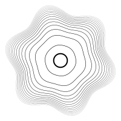

# SalamiVG ("Salami Vector Graphics")

A place to play with SVGs.

SalamiVG is a creative coding framework for JavaScript with a single render target: SVG.

## Why?

I love [OPENRNDR](https://openrndr.org/) and wanted to see if I could make a generative art framework that ran in an interpretted language. I've never been a JVM guy, and even though I like Kotlin, it sounded appealing to me to be able to write generative art in a language I used every day: JavaScript.

Of course you may (reasonably) ask why I'm not just using p5.js, the dominant JavaScript framework for writing generative art. Well, I don't have a good answer to that. I suppose this is really "just for fun" `¯\_(ツ)_/¯`. (There is a [more detailed comparison with p5.js in the Wiki](https://github.com/ericyd/salamivg/wiki/FAQ#why-not-p5js).)

## Installation

```
npm i --save @salamivg/core
```

If you use yarn and you can't automatically convert the above to the correct yarn command, then that's on you 😏

## Examples

There is [a Gallery page in the Wiki](https://github.com/ericyd/salamivg/wiki/Gallery) with some example renders and links to the code used to create them.

If you're the clone-n-run type, you can use the examples from the [`/examples` directory](./examples/) in this repo:

```js
git clone git@github.com:ericyd/salamivg
cd salamivg
npm ci
npm build
node examples/oscillator-noise.js
```

Here are some simple SVGs generated with SalamiVG

<details>

<summary>Concentric rings perturbated by a sine wave</summary>

```js
import { renderSvg, circle, hypot, vec2, map } from '@salamivg/core'

const config = {
  width: 100,
  height: 100,
  scale: 2,
  loopCount: 1,
}

renderSvg(config, (svg) => {
  // set basic SVG props
  svg.setBackground('#fff')
  svg.fill = null
  svg.stroke = '#000'
  svg.numericPrecision = 3

  // draw circle in middle of viewport
  svg.circle(
    circle({
      center: svg.center,
      radius: hypot(svg.width, svg.height) * 0.04,
      'stroke-width': 1,
    }),
  )

  // draw 14 concentric rings around the center. (14 is arbitrary)
  const nRings = 14
  for (let i = 1; i <= nRings; i++) {
    // use `map` to linearly interpolate the radius on a log scale
    const baseRadius = map(
      0,
      Math.log(nRings),
      hypot(svg.width, svg.height) * 0.09,
      hypot(svg.width, svg.height) * 0.3,
      Math.log(i),
    )

    // as the rings get further from the center,
    // the path is increasingly perturbated by the sine wave.
    const sineInfluence = map(
      0,
      Math.log(nRings),
      baseRadius * 0.01,
      baseRadius * 0.1,
      Math.log(i),
    )

    svg.path((p) => {
      // the stroke width gets thinner as the rings get closer to the edge
      p.strokeWidth = map(1, nRings, 0.8, 0.1, i)

      // the radius varies because the path is perturbated by a sine wave
      const radius = (angle) => baseRadius + Math.sin(angle * 6) * sineInfluence
      const start = Vector2.fromAngle(0).scale(radius(0)).add(svg.center)
      p.moveTo(start)

      // move our way around a circle to draw a smooth path
      for (let angle = 0; angle <= Math.PI * 2; angle += 0.05) {
        const next = Vector2.fromAngle(angle)
          .scale(radius(angle))
          .add(svg.center)
        p.lineTo(next)
      }
      p.close()
    })
  }
})
```

</details>



<details>

<summary>Oscillator noise</summary>

SalamiVG ships with a bespoke noise function called "oscillator noise".

```js
import {
  renderSvg,
  map,
  vec2,
  randomSeed,
  createRng,
  Vector2,
  random,
  ColorRgb,
  PI,
  cos,
  sin,
  ColorSequence,
  shuffle,
  createOscNoise,
} from '@salamivg/core'

const config = {
  width: 100,
  height: 100,
  scale: 3,
  loopCount: 1,
}

const colors = ['#B2D0DE', '#E0A0A5', '#9BB3E7', '#F1D1B8', '#D9A9D6']

renderSvg(config, (svg) => {
  // filenameMetadata will be added to the filename that is written to disk;
  // this makes it easy to recall which seeds were used in a particular sketch
  svg.filenameMetadata = { seed }

  // a seeded pseudo-random number generator provides controlled randomness for our sketch
  const rng = createRng(seed)

  // black background 😎
  svg.setBackground('#000')

  // set some basic SVG props
  svg.fill = null
  svg.stroke = ColorRgb.Black
  svg.strokeWidth = 0.25
  svg.numericPrecision = 3

  // create a 2D noise function using the built-in "oscillator noise"
  const noiseFn = createOscNoise(seed)

  // create a bunch of random start points within the svg boundaries
  const nPoints = 200
  const points = new Array(nPoints)
    .fill(0)
    .map(() => Vector2.random(0, svg.width, 0, svg.height, rng))

  // define a color spectrum that can be indexed randomly for line colors
  const spectrum = ColorSequence.fromColors(shuffle(colors, rng))

  // noise functions usually require some type of scaling;
  // here we randomize slightly to get the amount of "flowiness" that we want.
  const scale = random(0.05, 0.13, rng)

  // each start point gets a line
  for (const point of points) {
    svg.path((path) => {
      // choose a random stroke color for the line
      path.stroke = spectrum.at(random(0, 1, rng))

      // move along the vector field defined by the 2D noise function.
      // the line length is "100", which is totally arbitrary.
      path.moveTo(point)
      for (let i = 0; i < 100; i++) {
        let noise = noiseFn(path.cursor.x * scale, path.cursor.y * scale)
        let angle = map(-1, 1, -PI, PI, noise)
        path.lineTo(path.cursor.add(vec2(cos(angle), sin(angle))))
      }
    })
  }

  // when loopCount > 1, this will randomize the seed on each iteration
  return () => {
    seed = randomSeed()
  }
})
```

</details>


<details>

<summary>Recursive triangle subdivision</summary>

```js
/*
Rules

1. Draw an equilateral triangle in the center of the viewBox
2. Subdivide the triangle into 4 equal-sized smaller triangles
3. If less than max depth and <chance>, continue recursively subdividing
4. Each triangle gets a different fun-colored fill, and a slightly-opacified stroke
*/
import {
  renderSvg,
  vec2,
  randomSeed,
  createRng,
  Vector2,
  random,
  randomInt,
  PI,
  ColorSequence,
  shuffle,
  TAU,
  ColorRgb,
} from '@salamivg/core'

const config = {
  width: 100,
  height: 100,
  scale: 3,
  loopCount: 1,
}

let seed = 8852037180828291 // or, randomSeed()

const colors = [
  '#974F7A',
  '#D093C2',
  '#6F9EB3',
  '#E5AD5A',
  '#EEDA76',
  '#B5CE8D',
  '#DAE7E8',
  '#2E4163',
]

const bg = '#2E4163'
const stroke = ColorRgb.fromHex('#DAE7E8')

renderSvg(config, (svg) => {
  const rng = createRng(seed)
  const maxDepth = randomInt(5, 7, rng)
  svg.filenameMetadata = { seed, maxDepth }
  svg.setBackground(bg)
  svg.numericPrecision = 3
  svg.fill = bg
  svg.stroke = stroke
  svg.strokeWidth = 0.25
  const spectrum = ColorSequence.fromColors(shuffle(colors, rng))

  function drawTriangle(a, b, c, depth = 0) {
    // always draw the first triangle; then, draw about half of the triangles
    if (depth === 0 || random(0, 1, rng) < 0.5) {
      // offset amount increases with depth
      const offsetAmount = depth / 2
      const offset = vec2(
        random(-offsetAmount, offsetAmount, rng),
        random(-offsetAmount, offsetAmount, rng),
      )
      // draw the triangle with some offset
      svg.polygon({
        points: [a.add(offset), b.add(offset), c.add(offset)],
        fill: spectrum.at(random(0, 1, rng)).opacify(0.4).toHex(),
        stroke: stroke.opacify(1 / (depth / 4 + 1)).toHex(),
      })
    }
    // recurse if we're above maxDepth and "lady chance allows it"
    if (depth < maxDepth && (depth < 2 || random(0, 1, rng) < 0.75)) {
      const ab = Vector2.mix(a, b, 0.5)
      const ac = Vector2.mix(a, c, 0.5)
      const bc = Vector2.mix(b, c, 0.5)
      drawTriangle(ab, ac, bc, depth + 1)
      drawTriangle(a, ab, ac, depth + 1)
      drawTriangle(b, bc, ab, depth + 1)
      drawTriangle(c, bc, ac, depth + 1)
    }
  }

  // construct an equilateral triangle from the center of the canvas with a random rotation
  const angle = random(0, TAU, rng)
  const a = svg.center.add(Vector2.fromAngle(angle).scale(45))
  const b = svg.center.add(Vector2.fromAngle(angle + (PI * 2) / 3).scale(45))
  const c = svg.center.add(Vector2.fromAngle(angle + (PI * 4) / 3).scale(45))
  drawTriangle(a, b, c)

  // when loopCount > 1, this will randomize the seed on each iteration
  return () => {
    seed = randomSeed()
  }
})
```

</details>


## Getting Started, Documentation, and FAQ

[Please see the project Wiki](https://github.com/ericyd/salamivg/wiki)

## Design Philosophy

1. Inspired by the APIs of [OPENRNDR](https://openrndr.org/), expressed in idiomatic TypeScript
2. Local first
3. Fully type-checked and thoroughly documented
4. Small, fast, and focused
3. Don't take yourself too seriously

## Internal Development

Recommended: [install `asdf` version manager](https://asdf-vm.com/guide/getting-started.html). Then:

```shell
asdf plugin-add deno https://github.com/asdf-community/asdf-deno.git
asdf plugin add bun
asdf install
```

Install dependencies:

```shell
npm ci
```

Before committing:

```shell
npm run check:all
```

## Publishing

```shell
npm version minor
git push --tags && git push
./scripts/changelog.sh
npm login --registry https://registry.npmjs.org --scope=@salamivg
npm publish --access public
```

## NodeJS Version Compatibility

SalamiVG was developed with Node 23 but it probably works back to Node 14 or so.

This library has been tested against
* Node 23.9.0
* Node 20.8.0
* Node 18.19.0
* Node 16.20.2
* Attempted to test against Node 14 but [asdf](https://asdf-vm.com/) wouldn't install it on our M1 Mac. Please open an issue if this is causing you problems.

## Deno / Bun Support? Yes! 🎉

As of Deno v2.2.3 and Bun v1.2.4, SalamiVG is fully compatible with both Deno and Bun. You can check this claim yourself with the following commands, assuming you have `git` and `asdf` installed:

```shell
git clone git@github.com:ericyd/salamivg
cd salamivg
asdf plugin-add deno https://github.com/asdf-community/asdf-deno.git
asdf plugin add bun
asdf install
npm ci
npm run build
deno examples/concentric-circles.js
bun examples/concentric-circles.js
```

## ES Modules Only

SalamiVG ships ES Modules, and does not include CommonJS builds.

Is this a problem? Feel free to open an issue if you need CommonJS. It would probably be trivial to ship both ES Modules and CommonJS, but I'm not going to do this until it is requested.
