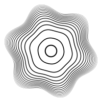

# SalamiVG ("Salami Vector Graphics")

A place to play with SVGs.

## Why?

I love [OPENRNDR](https://openrndr.org/) and wanted to see if I could make a generative art framework that ran in an interpretted language. I've never been a JVM guy, and even though I like Kotlin, it sounded appealing to me to be able to write generative art in a language I used every day: JavaScript.

Of course you may (reasonably) ask why I'm not just using p5.js, the dominant JavaScript framework for writing generative art. Well, I don't have a good answer to that. I suppose this is really "just for fun" `¯\_(ツ)_/¯`

## Installation

```
npm i --save @salamivg/core
```

If you use yarn and you can't automatically convert the above to the correct yarn command, then that's on you 😏

## Examples

See [the /sketch folder in my personal generative art repo](https://github.com/ericyd/generative-art/tree/57c17efb12df78fa5f4b5ab73adc6352a543cbbc/homegrown-svg/sketch) for some examples. 

Assuming you have configured your `package.json` to declare `"type": "module"`, you can simply run as a normal Node script:

```js
node example.js
```

Here are some simple SVGs generated with SalamiVG

<details>

<summary>Concentric rings perturbated by a sine wave</summary>

```js
import { renderSvg, circle, hypot, vec2, map } from '@salamivg/core'

const config = {
  width: 100,
  height: 100,
  scale: 2,
  loopCount: 1,
}

renderSvg(config, (svg) => {
  const center = vec2(svg.width, svg.height).div(2)
  svg.setBackground('#fff')
  svg.fill = null
  svg.stroke = '#000'

  svg.circle(circle({
    x: center.x,
    y: center.y,
    radius: hypot(svg.width, svg.height) * 0.04,
    'stroke-width': 1
  }))

  const nRings = 14
  for (let i = 1; i <= nRings; i++) {
    const baseRadius = map(0, Math.log(nRings), hypot(svg.width, svg.height) * 0.09, hypot(svg.width, svg.height) * 0.3, Math.log(i))
    const sineInfluence = map(0, Math.log(nRings), baseRadius * 0.01, baseRadius * 0.1, Math.log(i))
    svg.path((p) => {
      p.strokeWidth = map(1, nRings, 0.3, 0.05, i)
      let radius = baseRadius + Math.sin(0) * baseRadius * 0.1
      p.moveTo(vec2(Math.cos(0) * radius, Math.sin(0) * radius).add(center))
      for (let angle = 0; angle <= Math.PI * 2; angle += 0.05) {
        radius = baseRadius + Math.sin(angle * 6) * sineInfluence //baseRadius * 0.1
        p.lineTo(vec2(Math.cos(angle) * radius, Math.sin(angle) * radius).add(center))
      }
      p.close()
    })
  }
})
```

</details>



<details>

<summary>Oscillator noise</summary>

SalamiVG ships with a bespoke noise function called "oscillator noise".

```js
import {
  renderSvg,
  map,
  vec2,
  randomSeed,
  createRng,
  Vector2,
  random,
  ColorRgb,
  PI,
  cos,
  sin,
  ColorSequence,
  shuffle,
  createOscNoise,
} from '../lib/index.js'

const config = {
  width: 100,
  height: 100,
  scale: 3,
  loopCount: 1,
}

let seed = 5318189853830211 // randomSeed()

const colors = ['#B2D0DE', '#E0A0A5', '#9BB3E7', '#F1D1B8', '#D9A9D6']

renderSvg(config, (svg) => {
  svg.filenameMetadata = { seed }
  const rng = createRng(seed)
  svg.setBackground('#000')

  svg.fill = null
  svg.stroke = ColorRgb.Black
  svg.strokeWidth = 0.25
  svg.numericPrecision = 3

  const noise = createOscNoise(seed)
  const nPoints = 200
  const points = new Array(nPoints)
    .fill(0)
    .map(() => Vector2.random(0, svg.width, 0, svg.height, rng))
  const spectrum = ColorSequence.fromHexes(shuffle(colors, rng))

  const scale = random(0.05, 0.13, rng)
  for (const point of points) {
    svg.path((path) => {
      path.stroke = spectrum.at(random(0, 1, rng))
      path.moveTo(point)
      for (let i = 0; i < 100; i++) {
        let noiseVal = noise(path.cursor.x * scale, path.cursor.y * scale)
        let angle = map(-1, 1, -PI, PI, noiseVal)
        path.lineTo(path.cursor.add(vec2(cos(angle), sin(angle))))
      }
    })
  }

  // when loopCount > 1, this will randomize the seed on each iteration
  return () => {
    seed = randomSeed()
  }
})
```

</details>


## Guide

[Please see the Wiki](https://github.com/ericyd/salamivg/wiki)

## FAQ

[Please see the Wiki](https://github.com/ericyd/salamivg/wiki/FAQ)

## Design Philosophy

This lib is heavily inspired by [OPENRNDR](https://openrndr.org/), which means it utilizes the builder pattern extensively. My first attempt at writing my own SVG "framework" attempted to be much more functional, and I found the scripts to be really verbose and hard to follow. I think for the purpose of making art, imperative builder patterns are really nice.

## Development

Install dependencies:

```shell
npm i
```

Before committing:

```shell
npm run check:all
```

## Publishing

```shell
npm version minor
npm login --registry https://registry.npmjs.org --scope=@salamivg
npm publish --access public
```

## Compatibility

I developed this with Node 20 but I'd bet money it works back to like Node 14 or so.

### Deno / Bun?

Please open an issue if needed, although tbh I'd expect this to work fine with any JS runtime. The most modern JS feature this library uses is classes with private properties.

### ES Modules only

Is this a problem? Feel free to open an issue if you need commonjs. I think it would be trivial to set up rollup or similar to bundle into a commonjs package and include it in the exports, I just haven't done it because probably nobody will ever install this library.

## TODO

1. Describe why not https://www.npmjs.com/package/svg.js, or https://dmitrybaranovskiy.github.io/raphael/, or p5.js
2. Add comparisons to frameworks in other languages (see https://openrndr.org/ for example)
3. Finish public interface for "oscillator noise"
4. Finish "guide"
5. Set up CI
    - npm test
    - npm run check:format
    - npm run check:types
    - npm run lint
